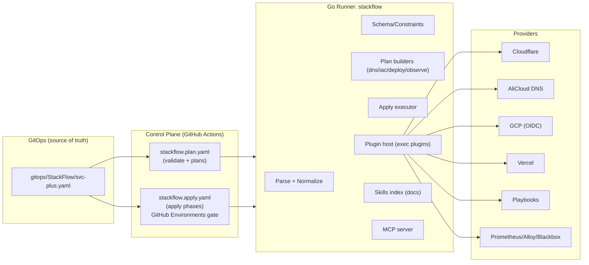

# StackFlow Runner 设计（Go / MCP / Skills / Plugins）

本文档定义 Go 版 StackFlow Runner 的整体架构与接口边界，并说明如何与 GitHub Actions（控制平面）协同，实现从域名到资源到部署到监控的完整上线工作流。

## 1. 设计目标

1. **单一声明源**：所有业务栈声明统一放在 `gitops/StackFlow/*.yaml`，不写入 secrets，不把状态回写到声明文件。
2. **Plan/Apply 分离**：默认只产出计划（Validate + Plan），Apply 需要显式开启并受 GitHub Environments 门禁控制。
3. **可插拔执行层**：DNS/IAC/Deploy/Observe 都通过 plugins 扩展；runner 只负责解析、校验、规划、编排与审计。
4. **可被 Agent 调用**：提供 MCP Server，支持 ChatOps/Agent 在不直接拿到云凭证的情况下触发 plan、查看结果、发起 apply（受门禁）。
5. **Skills 作为流程规范**：skills 不承载 secrets，只承载“标准做法/Runbook/治理约定”，并可被 runner 在输出中引用。

## 2. 关键概念

- **StackFlow Config**：业务栈 YAML（v1alpha1），描述 targets（vercel/vhost/cloud-run 等）、域名、DNS 记录意图、资源规格意图、部署方式意图、监控意图。
- **Phase**：`validate`、`dns-plan/apply`、`iac-plan/apply`、`deploy-plan/apply`、`observe-plan/apply`。
- **Plan Artifact**：每个 phase 的结构化输出（JSON），可上传为 GitHub Actions artifact，并写入 Step Summary。
- **Apply Gate**：GitHub Environments + required reviewers + secrets/OIDC 权限边界。
- **Plugin**：实现某一类 phase 的具体执行（如 Cloudflare DNS、Terraform、Ansible、Cloud Run、Prometheus/Alloy）。

## 3. 总体架构

## 4. Plan/Apply 工作流（与 stackflow.yaml 融合）

### 4.1 计划（Plan）

- `stackflow validate`
  - YAML 结构校验（schema）
  - 约束校验：
    - `targets[].domains[]` 必须在 `global.domain` 之下
    - DNS records 去重（同一 fqdn/type 不能重复）
    - `valueFrom` 引用必须存在（值可为空）
  - 输出：`stackflow.validate.json`

- `stackflow plan dns`
  - 汇总所有 `targets[].dns.records[]` 成扁平化 record 清单（带 target id）
  - 输出：`stackflow.dns-plan.json`

- `stackflow plan iac`
  - 把 `targets[].resources` 映射为 IaC 计划：
    - 需要的 module（如 `iac_modules/gcp/compute-instance`）
    - inputs（project/zone/cpu/mem/disk 等）
    - 期望 outputs（如 `endpoints.public_ipv4`）
  - 输出：`stackflow.iac-plan.json`

- `stackflow plan deploy`
  - 生成部署触发计划：
    - `vhost` -> playbooks 入口 + inventory/vars
    - `cloud-run` -> workflow_call 或 repository_dispatch payload
    - `vercel` -> 是否需要 vercel-side 配置校验/绑定域名
  - 输出：`stackflow.deploy-plan.json`

- `stackflow plan observe`
  - 生成监控对接计划：
    - blackbox targets
    - alloy/prometheus scrape configs
    - alert rules/dashboards 变更点
  - 输出：`stackflow.observe-plan.json`

> 计划阶段不需要写权限与云凭证；CI 中默认只跑 validate + plan。

### 4.2 执行（Apply）

Apply 必须满足：
- 工作流显式选择 `apply`（或合入某个触发条件）
- 目标环境为 GitHub Environment（如 `prod`）
- Environment 配置 required reviewers
- secrets/OIDC 权限仅在对应 apply job 可用

Apply 示例：
- `stackflow apply dns` -> Cloudflare/AliCloud DNS 写入
- `stackflow apply iac` -> Terraform apply（GCS remote state + lock）
- `stackflow apply deploy` -> 调用 Ansible / dispatch 子仓库部署
- `stackflow apply observe` -> 写入 observability repo/配置并触发生效

## 5. Plugins：为什么用 exec plugins

Go `.so` plugin 在不同 OS/Go 版本/CGO 环境下很脆弱；为了在 GitHub Actions 上稳定运行，建议采用 **exec plugins**：

- runner 发现：在 `PATH` 或 `./plugins/` 下寻找 `stackflow-plugin-*`
- runner 调用：通过 stdin/stdout JSON 交换
- 插件实现语言不限（Go/Python/Rust 都可）

详见：`plugin-spec.md`

## 6. MCP 支持

Runner 提供 MCP server：
- 允许 Agent/ChatOps 调用 validate/plan 并拉取 artifacts
- apply 仍受 GitHub Environments 限制（runner 也应在本地再次检查 gate/模式）

详见：`mcp.md`

## 7. Skills 支持

Skills 在这里的定位：
- 作为标准化“流程/治理/Runbook”
- runner 输出中可引用某个 skill 的路径（例如 release 分支治理、env/secrets 治理）
- apply 阶段可以做“技能建议”：例如检测到使用 Cloudflare DNS，则在 summary 中提示引用 DNS skill

> skills 不等于 plugins：skills 不执行云 API；plugins 才执行。

## 8. 对齐 XCloudFlow（融合点）

XCloudFlow 设计强调：Planner/Policy/Router/Orchestrator/State/Engines。
StackFlow Runner 是更窄的“业务栈编排器”，可以对齐为：

- **DSL/Config**：StackFlow YAML（业务栈）
- **Planner**：StackFlow plan phases（dns/iac/deploy/observe）
- **Policy**：validate + OPA/Conftest（后续可插）
- **Orchestrator**：apply 的 DAG（DNS -> IAC -> Deploy -> Observe）+ 并发限制
- **Engines**：plugins（dns/iac/deploy/observe）
- **State**：GitHub artifacts +（未来）远端 state service（Postgres/GCS）

因此 StackFlow 可以作为 XCloudFlow 在 Cloud-Neutral Toolkit 生态中的“落地子集”。

## 9. External Skills 支持（读取外部 skills）

需求：skills 不仅能读当前 repo 的 `skills/`，还要能读取外部 skills（本地目录、git 仓库、HTTP）。

建议实现：

- 技能源（sources）概念：`local|git|http`
- 技能加载顺序：
  1. repo-local `./skills/*/SKILL.md`
  2. 外部 sources（按优先级覆盖）
- 缓存：在 Cloud Run 模式下，外部 skills 的拉取结果应缓存到 PostgreSQL（避免容器重启丢失）

详见：`skills.md`

## 10. Agent 模式（状态/记忆存 PostgreSQL）

XCloudFlow 支持 Agent 模式运行：

- 作为常驻 worker 定时/事件驱动执行 `validate/plan/apply`
- 维护“记忆”（上次执行结果、漂移、告警、外部 MCP tools cache、技能缓存）

约束：

- XCloudFlow 服务本身保持无状态
- 所有状态/记忆写入 `postgresql.svc.plus`

Schema：`sql/schema.sql`

详见：`agent-mode.md`

## 11. Cloud Run 无状态部署

原则：

- 控制面无状态（多实例水平扩展）
- 状态与审计：PostgreSQL
- artifacts（plan/json/日志快照）：建议落到对象存储（GCS/S3）或由 CI artifacts 管理
- secrets：Cloud Run Secret Manager / GitHub OIDC（不要长期 key）

这使得 XCloudFlow 可以作为 Cloud Run 服务运行，同时也可作为 MCP server 提供对外能力。
